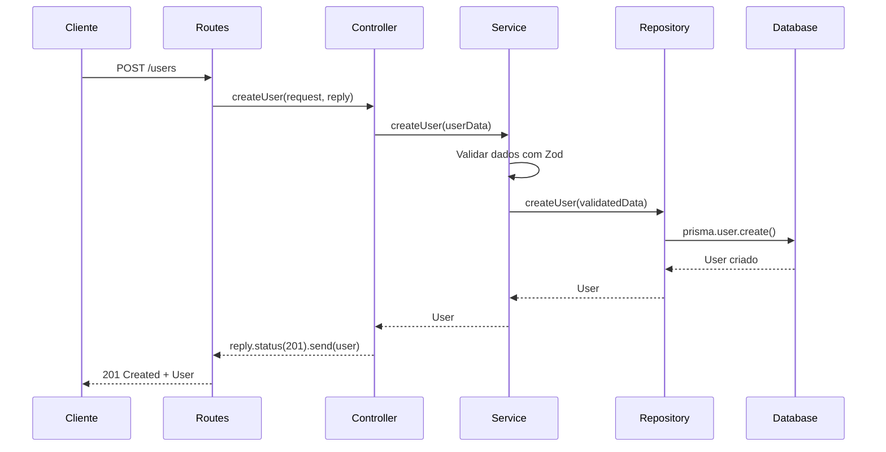
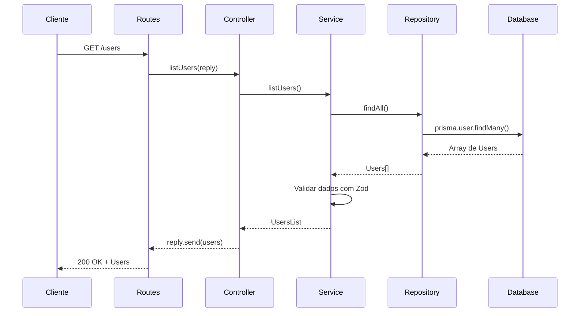

# 🚀 Fastify REST API - Sistema de Gerenciamento de Usuários

Uma API REST moderna construída com **Fastify**, **TypeScript**, **Prisma** e **Zod**, seguindo os princípios de **Clean Architecture** e **SOLID**.

## 📋 Índice

- [Visão Geral](#visão-geral)
- [Arquitetura do Projeto](#arquitetura-do-projeto)
- [Estrutura de Diretórios](#estrutura-de-diretórios)
- [Fluxo de Dados](#fluxo-de-dados)
- [Tecnologias Utilizadas](#tecnologias-utilizadas)
- [Como Executar](#como-executar)
- [Endpoints da API](#endpoints-da-api)
- [Exemplos de Uso](#exemplos-de-uso)

## 🎯 Visão Geral

Este projeto implementa um sistema completo de gerenciamento de usuários com as seguintes funcionalidades:

- ✅ **Criar usuários** com validação de dados
- ✅ **Listar todos os usuários** 
- ✅ **Validação robusta** com Zod
- ✅ **Banco de dados SQLite** com Prisma ORM
- ✅ **Arquitetura em camadas** (Controllers → Services → Repositories)
- ✅ **Injeção de dependências**
- ✅ **Tratamento de erros** específico por tipo

## 🏗️ Arquitetura do Projeto

O projeto segue a **Clean Architecture** com separação clara de responsabilidades:

```
┌─────────────────┐    ┌─────────────────┐    ┌─────────────────┐
│   Controllers   │───▶│    Services     │───▶│  Repositories   │
│   (HTTP Layer)  │    │ (Business Logic)│    │  (Data Access)  │
└─────────────────┘    └─────────────────┘    └─────────────────┘
         │                       │                       │
         ▼                       ▼                       ▼
┌─────────────────┐    ┌─────────────────┐    ┌─────────────────┐
│     Routes      │    │   Interfaces    │    │   Database      │
│  (URL Mapping)  │    │  (Contracts)    │    │   (SQLite)      │
└─────────────────┘    └─────────────────┘    └─────────────────┘
```

## 📁 Estrutura de Diretórios

### 🎮 **Controllers** (`src/controllers/`)
**Responsabilidade**: Gerenciar requisições HTTP e respostas
- Recebe requisições do cliente
- Valida dados de entrada
- Chama os serviços apropriados
- Retorna respostas HTTP com status codes corretos
- Trata erros e exceções

**Arquivos**:
- `CreateUserController.ts` - Controla criação de usuários
- `ListUserController.ts` - Controla listagem de usuários

### 🔧 **Services** (`src/services/`)
**Responsabilidade**: Implementar regras de negócio
- Contém a lógica de negócio da aplicação
- Valida dados usando schemas Zod
- Orquestra operações entre diferentes repositórios
- Não conhece detalhes de HTTP ou banco de dados

**Arquivos**:
- `CreateUserService.ts` - Lógica para criar usuários
- `ListUserService.ts` - Lógica para listar usuários

### 🗄️ **Repositories** (`src/repositories/`)
**Responsabilidade**: Acesso a dados
- Interface entre a aplicação e o banco de dados
- Implementa operações CRUD
- Usa Prisma ORM para queries
- Isola a lógica de persistência

**Arquivos**:
- `CreateUserRepository.ts` - Operações de criação no banco
- `ListUserRepository.ts` - Operações de leitura no banco

### 📋 **Interfaces** (`src/interfaces/`)
**Responsabilidade**: Contratos e tipos
- Define contratos (interfaces) para injeção de dependências
- Garante desacoplamento entre camadas
- Permite fácil substituição de implementações
- Facilita testes unitários

**Arquivos**:
- `ICreateUserService.ts` - Contrato do serviço de criação
- `ICreateUserRepository.ts` - Contrato do repositório de criação
- `IListUserService.ts` - Contrato do serviço de listagem
- `IListUserRepository.ts` - Contrato do repositório de listagem

### 📊 **Schemas** (`src/schemas/`)
**Responsabilidade**: Validação e tipagem de dados
- Define estruturas de dados com Zod
- Valida dados de entrada e saída
- Gera tipos TypeScript automaticamente
- Garante integridade dos dados

**Arquivos**:
- `CreateUserSchema.ts` - Schema para criação de usuários
- `ListUserSchema.ts` - Schema para listagem de usuários

### 🛣️ **Routes** (`src/routes/`)
**Responsabilidade**: Mapeamento de URLs
- Define endpoints da API
- Configura injeção de dependências
- Conecta URLs aos controladores
- Organiza rotas por funcionalidade

**Arquivos**:
- `createUserRoutes.ts` - Rotas para criação de usuários
- `listUserRoutes.ts` - Rotas para listagem de usuários

### 🔌 **Lib** (`src/lib/`)
**Responsabilidade**: Configurações e utilitários
- Configurações de bibliotecas externas
- Instâncias compartilhadas
- Utilitários globais

**Arquivos**:
- `prisma.ts` - Instância do cliente Prisma

### 🗃️ **Prisma** (`prisma/`)
**Responsabilidade**: Modelagem e migração do banco
- Define modelos de dados
- Gerencia migrações do banco
- Configura conexão com banco de dados

**Arquivos**:
- `schema.prisma` - Modelo de dados e configurações

### 🖥️ **Server** (`src/server.ts`)
**Responsabilidade**: Configuração e inicialização
- Configura o servidor Fastify
- Registra rotas
- Inicia o servidor HTTP
- Configura middlewares

## 🔄 Fluxo de Dados

### 📝 **Criação de Usuário**



**Passo a passo detalhado**:

1. **Cliente** envia requisição `POST /users` com dados do usuário
2. **Routes** (`createUserRoutes.ts`) recebe a requisição e chama o controller
3. **Controller** (`CreateUserController.ts`) extrai dados do body e chama o service
4. **Service** (`CreateUserService.ts`) valida dados com `CreateUserSchema` e chama o repository
5. **Repository** (`CreateUserRepository.ts`) usa Prisma para inserir no banco
6. **Database** (SQLite) armazena o usuário e retorna os dados
7. **Resposta** flui de volta pela cadeia com status 201 e dados do usuário criado

### 📋 **Listagem de Usuários**



**Passo a passo detalhado**:

1. **Cliente** envia requisição `GET /users`
2. **Routes** (`listUserRoutes.ts`) recebe a requisição e chama o controller
3. **Controller** (`ListUserController.ts`) chama o service
4. **Service** (`ListUserService.ts`) chama o repository
5. **Repository** (`ListUserRepository.ts`) usa Prisma para buscar todos os usuários
6. **Database** (SQLite) retorna array de usuários
7. **Service** valida os dados retornados com `UsersListSchema`
8. **Resposta** flui de volta pela cadeia com status 200 e lista de usuários

## 🛠️ Tecnologias Utilizadas

| Tecnologia | Versão | Propósito |
|------------|--------|-----------|
| **Fastify** | 5.4.0 | Framework web rápido e eficiente |
| **TypeScript** | 5.8.3 | Linguagem tipada para JavaScript |
| **Prisma** | 6.12.0 | ORM moderno para banco de dados |
| **Zod** | 4.0.10 | Validação de schemas e tipos |
| **SQLite** | - | Banco de dados leve e rápido |
| **TSX** | 4.20.3 | Executor TypeScript para desenvolvimento |

## 🚀 Como Executar

### Pré-requisitos
- Node.js 18+ 
- npm ou yarn

### 1. Instalar dependências
```bash
npm install
```

### 2. Configurar banco de dados
```bash
# Gerar cliente Prisma
npm run db:generate

# Executar migrações
npm run db:migrate
```

### 3. Executar em desenvolvimento
```bash
npm run dev
```

### 4. Executar em produção
```bash
npm run build
npm start
```

## 📡 Endpoints da API

### POST `/users` - Criar Usuário
**Cria um novo usuário no sistema**

**Body:**
```json
{
  "name": "João Silva",
  "email": "joao@email.com"
}
```

**Resposta de Sucesso (201):**
```json
{
  "id": "123e4567-e89b-12d3-a456-426614174000",
  "name": "João Silva",
  "email": "joao@email.com",
  "createdAt": "2024-01-15T10:30:00.000Z",
  "updatedAt": "2024-01-15T10:30:00.000Z"
}
```

**Possíveis Erros:**
- `400` - Dados inválidos (nome vazio, email inválido)
- `409` - Email já existe
- `500` - Erro interno do servidor

### GET `/users` - Listar Usuários
**Retorna todos os usuários cadastrados**

**Resposta de Sucesso (200):**
```json
[
  {
    "id": "123e4567-e89b-12d3-a456-426614174000",
    "name": "João Silva",
    "email": "joao@email.com",
    "createdAt": "2024-01-15T10:30:00.000Z",
    "updatedAt": "2024-01-15T10:30:00.000Z"
  },
  {
    "id": "456e7890-e89b-12d3-a456-426614174001",
    "name": "Maria Santos",
    "email": "maria@email.com",
    "createdAt": "2024-01-15T11:00:00.000Z",
    "updatedAt": "2024-01-15T11:00:00.000Z"
  }
]
```

**Possíveis Erros:**
- `500` - Erro interno do servidor

## 💡 Exemplos de Uso

### Usando cURL

**Criar usuário:**
```bash
curl -X POST http://localhost:3333/users \
  -H "Content-Type: application/json" \
  -d '{"name": "Ana Costa", "email": "ana@email.com"}'
```

**Listar usuários:**
```bash
curl -X GET http://localhost:3333/users
```

### Usando o arquivo requests.http
O projeto inclui um arquivo `requests.http` com exemplos prontos para usar no VS Code com a extensão REST Client.

## 🧪 Scripts Disponíveis

| Comando | Descrição |
|---------|-----------|
| `npm run dev` | Executa em modo desenvolvimento com hot reload |
| `npm run build` | Compila o projeto para produção |
| `npm start` | Executa versão compilada |
| `npm run db:migrate` | Executa migrações do banco |
| `npm run db:generate` | Gera cliente Prisma |
| `npm run db:studio` | Abre interface visual do Prisma |

## 🎯 Benefícios da Arquitetura

### ✅ **Separação de Responsabilidades**
- Cada camada tem uma responsabilidade específica
- Fácil manutenção e evolução
- Código organizado e legível

### ✅ **Testabilidade**
- Interfaces permitem mocks fáceis
- Cada camada pode ser testada isoladamente
- Injeção de dependências facilita testes

### ✅ **Escalabilidade**
- Fácil adicionar novas funcionalidades
- Baixo acoplamento entre camadas
- Reutilização de código

### ✅ **Manutenibilidade**
- Código bem documentado
- Padrões consistentes
- Estrutura clara e previsível

---

**Desenvolvido com ❤️ por Anderson Dias**

[GitHub](https://github.com/andersonDias89) | [LinkedIn](https://linkedin.com/in/anderson-dias-dev) 